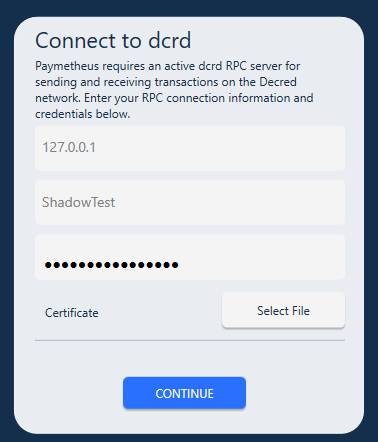

# **Guia de Instalação da Paymetheus** #

A Paymetheus é uma carteira com interface gráfica de fácil utilização para a Decred. Com ela você poderá enviar e receber DCR, comprar tickets para [votar na PoS](/mining/proof-of-stake.md), ter um histórico de todas suas transações e muito mais.
A única coisa que a Paymetheus não faz é votar na PoS.

---

## **Download e Instalação** ##
As instruções para download e instalação estão disponíveis [aqui](/getting-started/install-guide.md#windows-installer)

---

## **Iniciando a Paymetheus** ##
Você está pronto para iniciar a utilização da Decred! Inicie o programa 'Decred'. E verá a tela de conexão:  

  

>Dois programas estão sendo executados quando você inicia o Decred. A 'Paymetheus' que é a carteira com interface gráfica, que nós iremos falar sobre ela mais adiante
>e o 'dcrd' que é o daemon de comunicação (pronunciado como DEI-mon; um programa que é executado em segundo plano e que não interage diretamente com o usuário)
> ele se comunica diretamente com a rede Decred. Isso significar que você pode executar o dcrd
>em outro computador (como um servidor "always on") e utilizar a Paymetheus para se conectar com ele remotamente.

Iremos utilizar um local que a Paymetheus já iniciou, assim apenas pressione Continue.

> A primeira fez que a Paymetheus inicia, irá fazer o download da blockchain em segundo plano. Isso poderá demorar até uma hora.

---

## **Criar ou restaurar uma carteira** ##
Você terá a opção de criar uma nova carteira ou restaurar uma carteira através de uma seed. Se você está lendo isso, você provavelmente é novato e não possui uma carteira, então vamos criar uma nova. Se você clicar em "Restore", você o sistema irá solicitar que você insira suas "seed words", ao invés de mostrar uma nova seed.
O restante do processo é o mesmo. Clique em "Create a new wallet". E você verá a seguinte tela:  

  

<i class="fa fa-exclamation-triangle"></i> **PARE AQUI!!! NÃO CLIQUE NO "CONTINUE"! **

**Esta é a parte mais importante para utilizar a Decred. Na caixa branca estão sendo mostradas suas palavras chave (ou seed). Estas palavras são a chave da sua carteira. **
 **SEM ESTAS PALAVRAS OU A REPRESENTAÇÃO HEX VOCÊ PERDERÁ PERMANENTEMENTE O ACESSO ÀS SUAS MOEDAS!**  

**NÃO MOSTRE ELAS A NINGUÉM, NEM MESMO AOS DESENVOLVEDORES DA DECRED!**

Com essas palavras, qualquer pessoa poderá recriar sua carteira em outro computador e transferir seu saldo para outra carteira. Não é possível reverter uma transação na Decred, portanto se alguém roubar suas Decreds, não é possível receber elas de volta. 

<i class="fa fa-exclamation-triangle"></i> **NÀO UTILIZE A MESMA SEED EM DIFERENTES CARTEIRAS! Visite [o FAQ de Carteiras e Seeds](/faq/wallets-and-seeds.md#3-can-i-run-multiple-wallets) para verificar porque isso é importante. É recomendável que, se possível, criar uma nova carteira significar gerar uma nova seed.** 

A Decred e outras moedas digitais são geralmente descritas como sendo uma conta bancária. Isso é verdade, mas suas carteira, é como uma carteira física.
Se você perde sua carteira, você perderá acesso a tudo que guardava nela, e ninguém, nem mesmo os desenvolvedores da Decred poderão recuperá-la. Portanto, é bem importante
que você tire um tempo para ler esta página e ESCREVA as palavras chave em um local seguro. Uma boa idéia é escrever elas em um papel de guardá-las
em um local seguro e também armazená-las em um arquivo criptografados no seu computador. Armazenar na nuvem, em serviços como Dropbox ou OneDrive pode ser tranquilo, mas lembre-se que outras pessoas
poderão acessar elas, por isso é importante criptografar o arquivo (o MS Word ou o Libre/OpenOffice podem fazer isso).  

Ok, agora você tem a sua seed segura em pelo menos dois lugares diferentes. Clique em Continue. Agora solicitaremos que você digite ela novamente, para ter certeza que você as escreveu corretamente caso seja necessário resgatar sua carteira mais tarde. Note que você não poderá colar elas; você terá que digitar. 
Isso é para ter certeza que você tem as palavras salvas em outro local, e não apenas na função colar do seus sistema operacional. Após isso clique em Confirm.

---

## **Escolha uma senha privada (Private Passphrase) para sua carteira** ##
Insira uma senha para utilizar no momento que você for criar uma transação na rede. Existe também a opção de criar uma senha pública (Public Passphrase). Isso irá criptografar o arquivo com as informações de sua carteira, no seu computador.
Isso previnirá que alguém consiga ver suas contas e suas transações caso tenha acesso ao seu computador. Com as informações seguras, ninguém terá acesso aos seus fundos. Para muitas pessoas esta etapa é um exagero, se você é um desses basta deixar isto desmarcado.
Uma vez que você tenha inserido uma nova senha privada (e talvez uma pública), clique em Encrypt.  

Sua carteira será criada e sincronizada com a blockchain. Isso poderá levar alguns minutos em computadores lentos. Vale observar que suas senhas funcionarão em qualquer carteira Decred, não apenas na Paymetheus.

Continue para [Utilizando a Paymetheus](using-paymetheus.md)